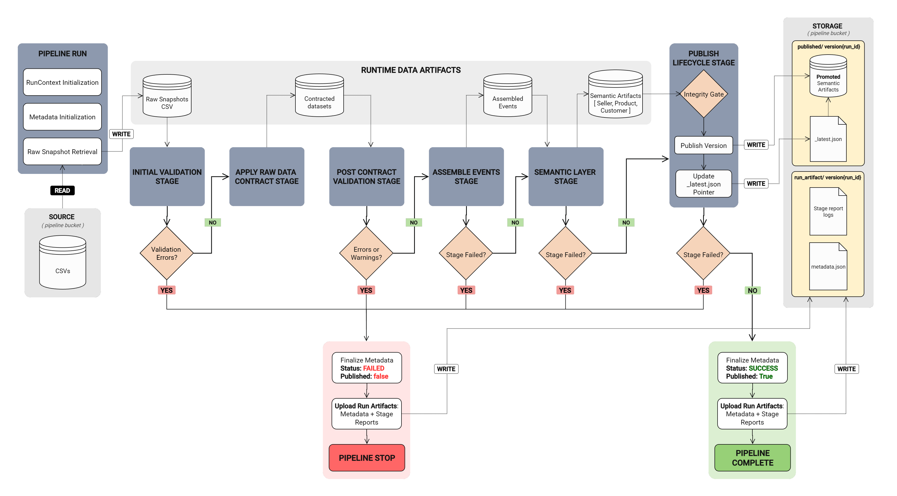

# **Run Pipeline**

File: [`run_pipeline.py`](../data_pipeline/run_pipeline.py)

**Role:**
Pipeline Orchestrator

**Purpose:**
Coordinate deterministic execution of the end-to-end data pipeline.
Control stage ordering, lifecycle tracking, failure handling, and publish activation for a single run.
Enforce forward-only stage progression and run isolation guarantees.

## **Inputs:**

RunContext

* Provides run identifier and all workspace paths.
* Supplies storage paths for raw snapshot retrieval, semantic publication, and run artifact persistence.

TABLE_CONFIG

* Declares logical table registry and processing order for contract enforcement.

Raw Data Snapshot

* Retrieved from storage into the run-scoped `raw_snapshot` directory.

Stage Modules

* [`validate_raw_data.py`](../data_pipeline/stages/validate_raw_data.py)
* [`apply_raw_data_contract.py`](../data_pipeline/stages/apply_raw_data_contract.py)
* [`assemble_validated_events.py`](../data_pipeline/stages/assemble_validated_events.py)
* [`build_bi_semantic_layer.py`](../data_pipeline/stages/build_bi_semantic_layer.py)
* [`publish_lifecycle.py`](../data_pipeline/stages/publish_lifecycle.py)

Storage Adapter

* [`storage_adapter.py`](../data_pipeline/shared/storage_adapter.py) for snapshot retrieval and artifact persistence.

## **Outputs:**

Run Workspace Artifacts

* Stage outputs written into run-scoped directories:

  * `raw_snapshot/`
  * `contracted/`
  * `assembled/`
  * `semantic/`

Structured Stage Logs

* JSON stage reports written to `logs/`:

  * `validation_initial.json`
  * `contract_report.json`
  * `validation_post_contract.json`
  * `assemble_report.json`
  * `semantic_report.json`
  * `publish_report.json`

Run Metadata

* `metadata.json` lifecycle record written to run workspace.

Published Semantic Artifacts

* Immutable semantic version promoted through the publish lifecycle.

Run Audit Artifacts

* Logs and metadata uploaded to storage run artifacts directory.

## **Coverage:**

Execution Lifecycle

* Run context initialization
* Workspace directory initialization
* Raw snapshot retrieval
* Stage orchestration
* Metadata lifecycle tracking
* Publish lifecycle execution
* Run artifact persistence

Stage Execution Order

1. Raw snapshot acquisition
2. Metadata initialization
3. Initial structural validation
4. Raw data contract enforcement
5. Post-contract validation
6. Event assembly
7. Semantic layer construction
8. Pre-publish integrity validation
9. Semantic promotion
10. Metadata finalization
11. Atomic publish activation

Severity Interpretation

* Errors returned from stage modules are interpreted and enforced by the orchestrator.

Contract Cascade Coordination

* Maintains invalid `order_id` propagation set between contract executions.

Run Lifecycle Tracking

* Initializes run metadata at pipeline start.
* Finalizes lifecycle state upon success or failure.

Run Artifact Persistence

* Uploads logs and metadata for audit retention.

## **Invariants:**

Forward-Only Execution

* Stages execute strictly in declared order.

Run Isolation

* All stage operations occur within a run-scoped workspace.

Single Run Identifier

* All artifacts produced during execution reference the same `run_id`.

Contract Mutation Boundary

* Only the Contract stage mutates datasets.

Severity Ownership

* Stage modules report findings but do not halt execution.
* The orchestrator determines halt behavior.

Deterministic Output

* Stage execution order and artifact naming remain stable for identical inputs.

Metadata Lifecycle Consistency

* `metadata.json` exists for the entire duration of the run.

Atomic Publish Visibility

* Published version becomes visible only after activation pointer update.

Run Artifact Persistence Guarantee

* Metadata and logs are persisted to storage regardless of success or failure.

## **Boundaries:**

This component **does:**

* Create and manage run execution context.
* Execute pipeline stages in defined order.
* Interpret stage severity results.
* Persist stage reports.
* Track metadata lifecycle state.
* Coordinate publish lifecycle execution.
* Persist audit artifacts.

This component **does NOT:**

* Perform validation logic.
* Enforce data contracts.
* Perform dataset assembly.
* Build semantic aggregates.
* Implement business logic or thresholds.
* Interpret semantic results.
* Generate alerts or interventions.

Stage logic resides exclusively in stage modules.

## **Failure Behavior:**

Stage Failure Handling

* Any stage failure triggers immediate pipeline termination.

Failure Conditions

* Validation errors in initial validation stage.
* Errors or warnings detected during post-contract validation.
* Assembly stage failure.
* Semantic stage failure.
* Publish lifecycle failure.

Metadata State Transition

* On failure:

  * `status = FAILED`
  * `completed_at` timestamp set
  * `published = false`

Exception Propagation

* Stage failures raise runtime exceptions which propagate to the orchestrator.

Finalization Guarantee

* Metadata finalization executes in both success and failure paths.

Artifact Persistence Guarantee

* Logs and metadata upload executes regardless of pipeline outcome.