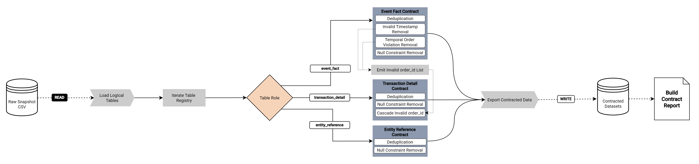

# **Apply Raw Data Contract**

File: [`apply_raw_data_contract.py`](../../data_pipeline/stages/apply_raw_data_contract.py)

**Role:**
Raw Data Structural Contract Enforcement Stage

**Purpose:**
Apply admissible structural repairs to raw datasets in order to produce contract-compliant datasets suitable for deterministic downstream processing.  
Remove rows that violate declared structural invariants while preserving dataset semantics.

## **Inputs:**

RunContext

* Provides access to the run-scoped raw snapshot directory.
* Provides output location for contracted datasets.

Logical Table Registry

* [`table_configs.py`](../../data_pipeline/shared/table_configs.py) defines:

  * table roles
  * non-nullable column constraints
  * timestamp fields and formats

Logical Tables

* Raw datasets loaded from the `raw_snapshot` directory.

Invalid Order Identifier Set

* Accumulated set of order identifiers invalidated by earlier contract executions.

Logical Table Loader

* [`loader_exporter.py`](../../data_pipeline/shared/loader_exporter.py) resolves logical tables from physical files.

## **Outputs:**

Contracted Logical Tables

* Cleaned datasets written to the `contracted` stage directory.

Contract Execution Report

* table identifier
* initial row count
* final row count
* removal metrics for each contract rule
* execution status
* error messages

Invalid Order Identifier Set

* Newly invalidated order identifiers emitted by event fact contract rules.

## **Coverage:**

Logical Table Loading

* Load datasets for each configured table from the raw snapshot directory.

Role-Driven Contract Enforcement

* Event Fact Tables

    * exact duplicate row removal
    * removal of rows containing unparsable timestamps
    * removal of rows violating chronological timestamp ordering
    * removal of rows containing null values in non-nullable columns

* Cascade Identifier Emission

    * collect invalid `order_id` values resulting from timestamp violations or parsing failures
    * propagate these identifiers to downstream contract executions

* Transaction Detail Tables

    * exact duplicate row removal
    * removal of rows containing null values in non-nullable columns
    * cascade removal of rows referencing invalid `order_id`

* Entity Reference Tables

    * exact duplicate row removal
    * removal of rows containing null values in non-nullable columns

Contract Execution Metrics

* deduplicated rows
* removed unparsable timestamp rows
* removed temporal violation rows
* removed null rows
* removed cascade rows

Dataset Export

* contracted datasets written as Parquet files.

## **Invariants:**

Deterministic Row Removal

* All removal decisions depend solely on dataset contents and declared contracts.

Role-Driven Contract Execution

* Contract rules are selected based on the table role defined in `[table_configs.py](../shared/table_configs.py)`.

No Value Modification

* Rows are removed but remaining values are not altered.

Timestamp Strictness

* Timestamp parsing strictly follows declared formats.

Cascade Propagation

* Invalid `order_id` values propagate only within the same pipeline run.

Dataset Export Location

* Contracted datasets are written only to the run-scoped `contracted` directory.

Logical Table Registry Authority

* Table roles and constraints originate from [`table_configs.py`](../../data_pipeline/shared/table_configs.py).
## **Boundaries:**

This component **does:**

* Load logical tables from the raw snapshot directory.
* Apply deterministic structural repair rules.
* Remove invalid rows.
* Emit invalid parent identifiers for cascade cleanup.
* Write contracted datasets to the contracted stage directory.
* Produce structured contract execution reports.

This component **does NOT:**

* Correct invalid values.
* Normalize domain values.
* Modify timestamps or numeric fields.
* Perform schema validation.
* Evaluate business thresholds or metrics.
* Halt pipeline execution.

Schema validation remains the responsibility of [`validate_raw_data.py`](../../data_pipeline/stages/validate_raw_data.py).

Pipeline halt decisions are owned by [`run_pipeline.py`](../../data_pipeline/run_pipeline.py).

## **Failure Behavior:**

Logical Table Load Failure

* Contract execution fails when a logical table cannot be loaded.

Unknown Table Identifier

* Contract execution fails if the table is not declared in the logical table registry.

Contract Execution Errors

* Exceptions raised by contract rules mark the table contract as failed.

Export Failure

* Dataset export failure results in contract stage failure for the table.

Failure Reporting

* Errors are recorded in the contract report.

Pipeline Halt Responsibility

* [`run_pipeline.py`](../../data_pipeline/run_pipeline.py) interprets contract results and determines whether execution continues.
