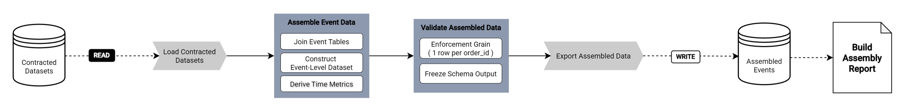

# **Assemble Validated Events**

File: [`assemble_validated_events.py`](../../data_pipeline/stages/assemble_validated_events.py)

**Role:**
Event Assembly Stage

**Purpose:**
Construct the canonical event-level dataset from contract-compliant source tables.  
Enforce the declared event grain and produce a deterministic dataset used as the foundation for semantic aggregation.

## **Inputs:**

RunContext

* Provides access to the run-scoped contracted dataset directory.
* Provides destination path for the assembled dataset.

Contracted Logical Tables
Loaded from the contracted stage directory:

* df_orders
* df_order_items
* df_payments

Logical Table Loader

* [`loader_exporter.py`](../../data_pipeline/shared/loader_exporter.pyy) resolves logical tables from physical files.

Assembly Schema Definition

* [`modeling_configs.py`](../../data_pipeline/shared/modeling_configs.pyy) declares the approved output schema.

Assembly Data Type Contract

* [`modeling_configs.py`](../../data_pipeline/shared/modeling_configs.pyy) defines required column data types.

Run Identifier

* Provided by RunContext and applied as a lineage attribute.

## **Outputs:**

Assembled Event Dataset

* Deterministic event-grain dataset written to the run-scoped `assembled` directory.

Assembly Execution Report
Structured dictionary containing:

* stage status
* step-level reports
* error messages
* informational logs

Exported Dataset File

* `assembled_events_<YYYY>_<MM>.parquet`

## **Coverage:**

Contracted Table Loading

* Load required event tables from the contracted stage directory.

Event Dataset Construction

* Merge contracted tables to produce the event-grain dataset.

Join Path Enforcement

* df_orders &rarr; df_order_items (inner join)
* df_orders &rarr; df_payments (left join)

Cardinality Enforcement

* The merged dataset must contain exactly one row per `order_id`.

Derived Field Generation

* lead_time_days
* approval_lag_days
* delivery_delay_days
* order_date
* order_year
* ISO week attributes
* run_id lineage field

Timestamp Standardization

* Convert timestamp columns to datetime types.

Schema Freeze Enforcement

* project only approved schema columns
* enforce declared data types
* deterministic sorting by order identifier
* reset index for clean output

Dataset Export

* Export the assembled dataset to the run-scoped `assembled` directory.

## **Invariants:**

Event Grain Enforcement

* Exactly one row per `order_id`.

Join Determinism

* Join structure is fixed and does not vary between runs.

Schema Projection

* Output dataset contains only declared schema columns.

Data Type Enforcement

* All columns are cast to the declared schema types.

Deterministic Ordering

* Output rows are sorted by `order_id`.

Lineage Attribution

* Each record includes the run identifier.

Stage Isolation

* Input data is read exclusively from the contracted stage directory.

## **Boundaries:**

This component **does:**

* Load contracted event tables.
* Merge datasets using declared join paths.
* Enforce event-level grain constraints.
* Derive analytical time attributes.
* Apply schema projection and data type enforcement.
* Produce a deterministic event dataset.
* Export the assembled dataset to the workspace.

This component **does NOT:**

* Validate raw data structure.
* Repair or modify invalid records.
* Apply business rules or thresholds.
* Perform semantic aggregation.
* Interpret fulfillment performance metrics.
* Halt pipeline execution.

Data validation occurs in [`validate_raw_data.py`](../../data_pipeline/stages/validate_raw_data.py).

Structural repair occurs in [`apply_raw_data_contract.py`](../../data_pipeline/stages/apply_raw_data_contract.py).

Semantic aggregation occurs in [`build_bi_semantic_layer.py`](../../data_pipeline/stages/build_bi_semantic_layer.py).

Pipeline control remains the responsibility of [`run_pipeline.py`](../../data_pipeline/run_pipeline.py).

## **Failure Behavior:**

Missing Contracted Tables

* Assembly fails when required logical tables cannot be loaded.

Join Cardinality Violation

* Runtime error raised when merged dataset does not match the expected order-level grain.

Derived Field Calculation Errors

* Exceptions raised during timestamp conversion or duration calculation propagate to the caller.

Schema Contract Violation

* Missing required columns result in runtime failure during schema freeze.

Export Failure

* Dataset export failure marks the stage as failed.

Failure Reporting

* Errors are captured in the assembly report.

Pipeline Halt Responsibility

* [`run_pipeline.py`](../../data_pipeline/run_pipeline.py) interprets assembly failure and halts pipeline execution.