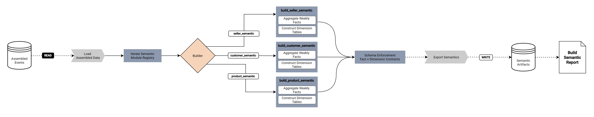

# **Build BI Semantic Layer**

File: [`build_bi_semantic_layer.py`](../../data_pipeline/stages/build_bi_semantic_layer.py)

**Role:**
Semantic Layer Construction Stage

**Purpose:**
Transform the assembled event dataset into BI-safe semantic modules consisting of fact and dimension tables with enforced analytical grains.
Produce deterministic semantic artifacts suitable for direct consumption by downstream BI tools.

## **Inputs:**

RunContext

* Provides access to the assembled dataset directory.
* Provides destination path for semantic artifacts.

Assembled Event Dataset

* Event-grain dataset produced by [`assemble_validated_events.py`](../../data_pipeline/stages/assemble_validated_events.py).

Logical Table Loader

* [`loader_exporter.py`](../../data_pipeline/shared/loader_exporter.py) resolves the assembled dataset.

Semantic Schema Definitions

* [`modeling_configs.py`](../../data_pipeline/shared/modeling_configs.py) declares:

  * fact table schemas
  * dimension table schemas
  * required data types

Contracted Reference Tables

* df_customers
* df_products

Semantic Module Registry

* Internal registry defining semantic modules, builder functions, table contracts, and grain constraints.

## **Outputs:**

Semantic Module Artifacts

* seller_semantic
* customer_semantic
* product_semantic

Exported Tables

* Seller Semantic

    * seller_weekly_fact_<YYYY>_<MM>.parquet
    * seller_dim_<YYYY>_<MM>.parquet

* Customer Semantic

    * customer_weekly_fact_<YYYY>_<MM>.parquet
    * customer_dim_<YYYY>_<MM>.parquet

* Product Semantic

    * product_weekly_fact_<YYYY>_<MM>.parquet
    * product_dim_<YYYY>_<MM>.parquet

Semantic Execution Report

* stage status
* module-level reports
* table-level reports
* error messages
* informational logs

## **Coverage:**

Assembled Dataset Loading

* Load the event-grain dataset from the assembled stage directory.

Semantic Module Execution

* Execute registered semantic module builders defined in the module registry.

Seller Semantic Module

* Fact Grain

    * one row per (seller_id, order_year_week)

* Dimension Grain

    * one row per seller_id

Derived Aggregations

* weekly order count
* delivered order count
* cancelled order count
* weekly revenue
* lead time statistics
* delivery delay statistics
* approval lag statistics

Customer Semantic Module

* Fact Grain

    * one row per (customer_id, order_year_week)

* Dimension Grain

    * one row per customer_id

Product Semantic Module

* Fact Grain

    * one row per (product_id, order_year_week)

* Dimension Grain

    * one row per product_id

Derived Attributes

* ISO week alignment via week_start_date
* boolean delivery and cancellation indicators

Dimension Construction

* Reference attributes sourced from contracted datasets.

Schema Freeze for each semantic table:

* enforce declared schema projection
* enforce declared data types
* validate grain uniqueness
* deterministic sorting by grain columns

Dataset Export

* write semantic tables into module directories under the semantic stage path.

## **Invariants:**

Event Lineage Preservation

* All semantic tables contain the same run identifier.

Single Run Dataset

* Assembled dataset must contain exactly one run identifier.

Grain Enforcement

* Fact tables enforce declared composite grain keys.
* Dimension tables enforce entity-level uniqueness.

Schema Contract Enforcement

* output schema must exactly match declared schema definitions.

Data Type Enforcement

* columns must match declared data types.

Deterministic Output Ordering

* semantic tables are sorted by grain columns.

Semantic Module Registry Authority

* semantic modules are constructed only from registered module definitions.

Stage Isolation

* input dataset is read only from the assembled stage directory.

## **Boundaries:**

This component **does:**

* load the assembled event dataset
* construct semantic modules using registered builders
* aggregate event data to entity-week analytical grains
* build entity dimension tables
* enforce schema and grain contracts
* export BI-safe semantic artifacts
* generate structured semantic execution reports

This component **does NOT:**

* validate raw data structure
* repair raw data
* modify event-grain records
* apply business thresholds
* perform intervention logic
* determine operational actions
* publish artifacts to external storage

Data validation occurs in [`validate_raw_data.py`](../../data_pipeline/stages/validate_raw_data.py).

Structural repair occurs in [`apply_raw_data_contract.py`](../../data_pipeline/stages/apply_raw_data_contract.py).

Event dataset construction occurs in [`assemble_validated_events.py`](../../data_pipeline/stages/assemble_validated_events.py).

Artifact publication is handled by [`publish_lifecycle.py`](../../data_pipeline/stages/publish_lifecycle.py).

Pipeline control remains the responsibility of [`run_pipeline.py`](../../data_pipeline/run_pipeline.py).

## **Failure Behavior:**

Assembled Dataset Missing

* Stage fails when the assembled dataset cannot be loaded.

Multiple Run Identifiers

* Runtime failure when multiple run identifiers are detected in the dataset.

Semantic Builder Failure

* Exceptions raised during module construction halt the semantic stage.

Grain Violations

* Duplicate records violating declared grain keys cause module failure.

Schema Violations

* Missing required columns cause table validation failure.

Export Failure

* Dataset export failure marks the module and stage as failed.

Failure Reporting

* Errors recorded in module-level and table-level reports.

Pipeline Halt Responsibility

* [`run_pipeline.py`](../../data_pipeline/run_pipeline.py) interprets stage failure and terminates execution.