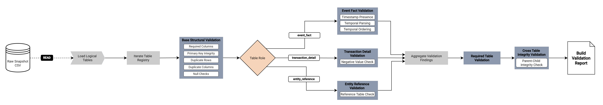

# **Validate Raw Data**

File: [`validate_raw_data.py`](../../data_pipeline/stages/validate_raw_data.py)

**Role:**
Raw Data Structural Validation Stage

**Purpose:**
Evaluate raw datasets against declared structural contracts before any mutation or transformation occurs. 
Detect schema violations, structural inconsistencies, and cross-table integrity issues that would compromise downstream assembly or semantic aggregation.

## **Inputs:**

RunContext

* Provides access to the run-scoped raw snapshot directory.

Logical Table Registry

* [`table_configs.py`](../../data_pipeline/shared/table_configs.py) defines:

  * table identifiers
  * role classifications
  * primary key definitions
  * required column declarations
  * non-nullable column constraints

Timestamp Contract Definitions

* Required timestamp columns.
* Declared timestamp formats.

Logical Tables

* Raw datasets stored in the run-scoped `raw_snapshot` directory.

Logical Table Loader

* [`loader_exporter.py`](../../data_pipeline/shared/loader_exporter.py) resolves logical tables from physical files.

Optional Base Path Override

* Allows validation against the contracted layer during post-contract validation.

## **Outputs:**

Validation Report
Structured dictionary containing:

* status
* errors
* warnings
* informational messages

Validation Logs

* Informational messages describing load and validation activity.

Loaded Logical Tables

* In-memory datasets used during validation.

No physical dataset output is produced by this stage.

## **Coverage:**

Logical Table Loading

* Resolve and load logical tables from the specified base directory.

Baseline Structural Validation

* Applied to all configured tables:

  * dataset emptiness detection
  * required column presence verification
  * primary key column presence verification
  * conflicting duplicate primary key detection
  * identical duplicate row detection
  * duplicate column name detection
  * null values within primary key columns
  * null values in declared non-nullable columns

Role-Specific Validation

* Event Fact Tables

  * Required timestamp column presence
  * Timestamp parseability enforcement
  * Temporal ordering validation between purchase, approval, and delivery timestamps

Transaction Detail Tables

* Detection of negative numeric values

Cross-Table Validation

* Referential Integrity Checks

  * order items referencing non-existent order identifiers
  * payments referencing non-existent order identifiers

Missing Table Detection

* Identify logical tables declared in the registry but not present in the dataset.

Severity Classification

* Errors &rarr; Structural violations that invalidate the dataset.

* Warnings &rarr; Admissible issues that may be repairable by the Contract stage.

* Informational Messages &rarr; Diagnostic messages indicating skipped validations or load status.

## **Invariants:**

Non-Mutating Operation

* No rows are removed or modified.

Logical Table Registry Authority

* All validation rules derive from [`table_configs.py`](../../data_pipeline/shared/table_configs.py).

Deterministic Validation

* Validation results depend solely on dataset contents.

Timestamp Format Strictness

* Timestamp parsing uses declared formats only.

Stage Isolation

* Data is read exclusively from the specified stage directory.

Severity Reporting

* Validation produces findings but does not halt execution.

## **Boundaries:**

This component **does:**

* Load logical tables from the stage directory.
* Evaluate datasets against structural contracts.
* Detect schema and primary key violations.
* Evaluate timestamp validity and ordering.
* Detect numeric anomalies in transaction detail tables.
* Evaluate cross-table referential integrity.
* Produce structured validation reports.

This component **does NOT:**

* Remove rows.
* Correct invalid values.
* Deduplicate records.
* Modify timestamps or numeric values.
* Enforce business logic or thresholds.
* Halt pipeline execution.

Repair actions are performed exclusively by [`apply_raw_data_contract.py`](../../data_pipeline/stages/apply_raw_data_contract.py).

Pipeline halt decisions are owned by [`run_pipeline.py`](../../data_pipeline/run_pipeline.py).

## **Failure Behavior:**

Validation Errors

* Recorded in the report and returned to the orchestrator.

Warnings

* Recorded but do not block this stage.

Logical Table Load Failure

* Missing tables produce error findings.

Timestamp Parsing Failure

* Recorded as warnings.

Unexpected Runtime Exceptions

* Propagate to the caller.

Pipeline Halt Responsibility

* [`run_pipeline.py`](../../data_pipeline/run_pipeline.py) determines whether validation findings halt execution based on the global severity model.
